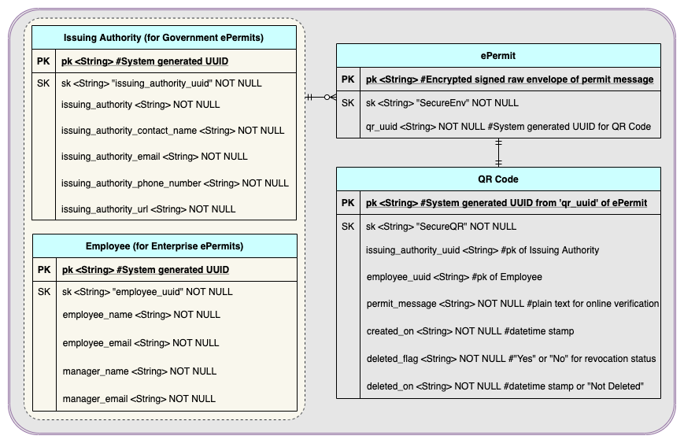

# ePermit
QR Code based digital identity with offline and online verification capabilities.
</img>

## Intro

QR Codes have become ubiquitous due to their simplicity.  One of the usecases pertains to enterprises and governments using QR Codes for providing people with digital passes for authorized entry to buildings or for permitted travel during a lockdown.  To make a QR Code tamper proof, one of the techniques is to embed a URL which can be verified online.  However this poses a challenge when there is no data connectivity.  I am proposing an alternate solution to encrypt and digitally sign the contents of a static QR Code.  It not only ensures security, but also becomes easy to verify and validate the QR Code in an offline mode with custom mobile apps.

Below are the solution details for custom mobile native apps on iOS and Android towards offline verification, along with ability for online verification.

<table style = "margin-left:auto; margin-right:auto">
  
  <tr>
    <th><a href="#workflow-architecture--design">Workflow Architecture / Design</a></th>
    <th><a href="#downloads">Downloads</a></th>
    <th><a href="#demo-videos">Demo Videos</a></th>
    <th><a href="#contact">Contact</a></th>
  </tr>
  
  <tr>
    <td>&nbsp;&nbsp;&nbsp;➤ <a href="#government"</a>Government</td>
    <td></td>
    <td></td>
    <td></td>
  </tr>
  
  <tr>
    <td>&nbsp;&nbsp;&nbsp;➤ <a href="#enterprise">Enterprise</a></td>
    <td></td>
    <td></td>
    <td></td>
  </tr>
  
  <tr>
    <td>&nbsp;&nbsp;&nbsp;➤ <a href="#database">Database</a></td>
    <td></td>
    <td></td>
    <td></td>
  </tr>
  
</table>

## Workflow Architecture / Design

### Government
As described below, any official of a government department (called "Issuing Authority") authorized to issue ePermits to citizens, registers in the system and generates an ePermit.  The system has the capability to deliver the ePermit to a citizen in any one of the multiple channels - Email or SMS or WhatsApp or Telegram.  The delivered ePermit can both be offline verified via a native mobile app or online via a browser.

  </img>

[</img>](#intro)

### Enterprise
As described below, any employee of an enterprise authorized to issue ePermits to self or visitors, registers in the system and generates an ePermit.  The system has the capability to deliver the ePermit to an employee in any one of the multiple channels - Email or SMS or WhatsApp or Telegram.  The delivered ePermit can both be offline verified via a native mobile app or online via a browser.

  </img>

[</img>](#intro)

### Database
The primary design consideration while designing the database is a NoSQL schema, with a database like DynamoDB:

  </img>

[</img>](#intro)

## Downloads
The iOS and Android apps for offline verification can be downloaded from the respective app store:

<table>

	<tr>
	
		<td>
			

  				<a href="https://apps.apple.com/in/app/safety-suite-permit/id1517865742"></img></a>
			

		</td>
	
		<td>
			

  				<a href="https://play.google.com/store/apps/details?id=com.safetysuite.permit"></img></a>
			

		</td>
		
	</tr>

</table>

[</img>](#intro)

## Demo Videos
The demo videos of the iOS and Android apps showcasing the offline verification functionality for a sample enterprise implementation:

<table>

	<tr>
	
		<td>
			

  				<a href="https://bit.ly/permit-ios"></img></a>
			

		</td>
	
		<td>
			

  				<a href="https://bit.ly/permit-android"></img></a>
			

		</td>
		
	</tr>

</table>

[</img>](#intro)

## Contact
Please get in touch with me @[Vaidyanathan Sivasubramanian](mailto:svaidyan_signup@hotmail.com).

[</img>](#intro)
